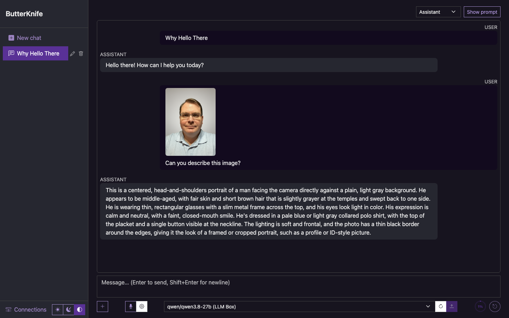

# ButterKnife

A self-hosted chat UI for the LLMs on your own network. Blazor Server, one SQLite file, no cloud unless you add an
Anthropic connection. Talks to Ollama, LM Studio and anything OpenAI-compatible, streams replies as markdown, takes
image attachments, dictates prompts through a local Whisper server, and keeps every conversation.



## Features

- **Connections** managed in the UI with presets for Ollama, LM Studio, generic OpenAI-compatible servers, Anthropic,
  and Whisper speech-to-text. API keys are encrypted at rest. Add a server, press Test, pick a model.
- **Settings** page (General, Connections) that takes over the whole window; General sets the name shown above your
  messages and whether the app is reachable from other devices on the local network (applied on restart), both stored
  server-side so every device sees them.
- **Open on phone**: a button on desktop-sized screens shows a QR code that opens the current chat on a phone on the
  same Wi‑Fi.
- **Streaming chat** with markdown rendering, a stop button, and a stats line (time to first token, prompt tokens and
  rate, generation rate) under each reply.
- **Personas**: named system prompts (Assistant, Programmer, Lawyer, Doctor, Writer, Teacher, Analyst, Product
  Describer, Copywriter are built in), chosen per conversation.
- **Images**: attach up to six per message; sent in each backend's native encoding for vision models.
- **Context meter** showing how much of the model's window the conversation uses, and **compaction** that summarises
  older turns so long chats keep fitting, on demand or automatically.
- **Dictation**: a microphone button that records, stops when you pause, and transcribes via a local Whisper server
  (Speaches, faster-whisper-server, whisper.cpp, LocalAI) or the browser's own speech recognition.
- Light, dark, or follow-the-system colour mode from the toggle in the top bar, remembered per browser.
- Everything persists server-side, so a phone and a laptop on the LAN see the same conversations. Chats can be
  renamed and deleted from the sidebar or the chat toolbar, with an inline confirmation before deleting.

## Download and run

Grab the build for your machine from the [Releases page](https://github.com/rskulles/ButterKnife/releases). Nothing else
to install: the .NET runtime is inside.

- **Windows**: unzip, run `ButterKnife.exe`. It has no window of its own: a butter knife appears in the system tray
  with *Open ButterKnife*, *Copy address for phone* and *Quit*. The executable is code-signed; if SmartScreen still
  shows "Windows protected your PC" while the certificate is new, click *More info* then *Run anyway*. Its database,
  keys and log live in a `data` folder next to the executable, so the folder can be moved or backed up as one.
- **macOS**: open the `.dmg` for Apple Silicon (`osx-arm64`) or Intel (`osx-x64`) and drag ButterKnife to
  Applications. The app is signed and notarized. It lives in the menu bar (no Dock icon) with the same three items.
  Data is in `~/Library/Application Support/ButterKnife`, the server log in `~/Library/Logs/ButterKnife`.
- **Linux**: unpack the `.tar.gz` and run `./ButterKnife` in a terminal; Ctrl+C stops it. Data lives in `data` next
  to the executable.

The app opens in your browser at <http://localhost:5175>. Set `BUTTERKNIFE_NO_BROWSER=1` to stop it opening a browser,
and `ASPNETCORE_URLS` to change the port. **Settings → General** also has a *Quit ButterKnife* button, handy from a
phone.

Then go to **Settings → Connections** and add your servers with the preset buttons. To reach the app from other devices on
your network, turn on **Reachable from other devices on the local network** under **Settings → General** and restart.

## Quick start from source

Requires the .NET 10 SDK.

```bash
dotnet run --project src/ButterKnife
```

Open <http://localhost:5175>. The network switch above works here too; to bind to all interfaces once without it:

```bash
dotnet run --project src/ButterKnife --urls http://0.0.0.0:5175
```

Notes per server:

- **Ollama** listens on localhost only by default. Set `OLLAMA_HOST=0.0.0.0` on that machine so it accepts LAN
  connections. Base URL is the server root, e.g. `http://ollama.local:11434`.
- **LM Studio**: start the server in the Developer tab and enable *Serve on local network*. Base URL includes `/v1`.
- **Anthropic** needs an API key from console.anthropic.com. The default model is `claude-opus-5`.
- **Whisper**: whisper.cpp's server uses its root (`http://host:8080`); OpenAI-style servers use `/v1`. Either works.
  Browser microphone access needs a secure context, i.e. `https` or `localhost`, so dictation from another device
  needs the app behind TLS.

## Configuration

`src/ButterKnife/appsettings.json` (override per environment or with `Section__Key` environment variables):

| Section | Keys | Purpose |
|---|---|---|
| `Database` | `ConnectionString` | SQLite file; default `Data Source=data/butterknife.db`, relative to the app. Git-ignored. |
| `Llm` | `Backends` | Seed connections, used only when the connections table is empty on first start. Empty by default; `appsettings.Development.json` seeds two placeholders for development. |
| `Llm` | `DefaultPersona`, `AutoCompactThreshold`, `CompactKeepRecentTurns` | New-chat persona; compact when usage passes this fraction of the window (0 disables); turns kept verbatim after a compaction. |
| `Dictation` | `AutoStopOnSilence`, `AutoSendAfterTranscription`, `SilenceDurationMs`, `MaxRecordingSeconds` | Defaults for the microphone; each browser can override the two toggles from the ⚙ beside the mic. |

API keys are protected with ASP.NET Core Data Protection, whose keys live in the user profile of the account running
the app. Run it as another user or on another machine and stored keys read back empty; re-enter them.

## Project layout

```
src/ButterKnife/
  Components/Pages/      Chat.razor (markup + code in one file, sectioned by comment banners),
                         Settings.razor (/settings, /settings/{section}; /connections still works)
  Components/Settings/   GeneralSettings, ConnectionsSettings (.razor + .razor.cs): the sections
  Components/Shared/     ButterKnifeThrobber (the sprite + stats readout), ThemeToggle
  Components/Layout/     MainLayout + NavMenu (conversation list), SettingsLayout (section list)
  Services/              ILlmClient + OllamaClient / OpenAiCompatibleClient / AnthropicLlmClient,
                         LlmClientRegistry, ModelCatalog, ConversationCompactor, TokenEstimator,
                         TranscriptionClient/Service, MarkdownRenderer, ConnectionPresets, DI extensions
  Data/                  SqliteDatabase (schema, migrations, seeding) and the stores:
                         conversations, personas, connections, settings; in-process change events
  Options/               LlmOptions, DictationOptions, DatabaseOptions
tests/ButterKnife.Tests/ xUnit; HTTP clients are tested against a stub HttpMessageHandler, stores against temp SQLite files
tools/stub-llm-server.py Fake Ollama / OpenAI / Anthropic / whisper.cpp server for offline development
```

How the pieces fit:

- A **connection** (kind + base URL + optional key) is turned into an `ILlmClient` per use by `LlmClientFactory`.
  Clients stream `ChatDelta` items: text, then a final usage report when the backend gives one.
- The chat page builds each request from the persona, the running compaction summary, and the turns after the
  summary checkpoint; the stored transcript is never modified.
- Schema changes are forward-only: `SqliteDatabase` creates tables if missing and adds columns with
  `AddColumnIfMissingAsync`, so an existing database upgrades in place on start.

`CLAUDE.md` goes deeper into the conventions and the reasons behind them.

## Development

The stylesheet is a [Bootswatch](https://bootswatch.com) "pulse" build of Bootstrap 5.3.8 committed at `wwwroot/bootstrap_pulse.min.css`; swap the link in `App.razor` to re-theme (the earlier "morph" build is still in `wwwroot` for that). Pulse uses the system font stack, so nothing is fetched from the internet. Bootstrap's JS bundle and Bootstrap Icons are pinned with [LibMan](https://learn.microsoft.com/aspnet/core/client-side/libman/)
in `src/ButterKnife/libman.json`, and the restored files in `wwwroot/lib/` are committed so builds need no download.
To add or update one, use the CLI, a local dotnet tool, then commit the changed files:

```bash
dotnet tool restore
cd src/ButterKnife && dotnet libman install <library>@<version> --files <path> ...
```

```bash
dotnet build
dotnet test
dotnet test --filter "FullyQualifiedName~OllamaClientTests"          # one class
dotnet format --verify-no-changes                                     # style; warnings fail the build
dotnet watch --project src/ButterKnife                                # hot reload
```

To work without real models, run the stub server and add connections pointing at it
(`http://127.0.0.1:11434` for Ollama or whisper.cpp kinds, `http://127.0.0.1:11434/v1` for OpenAI-compatible or
Anthropic):

```bash
python3 tools/stub-llm-server.py --delay 0.25   # slower tokens make streaming UI easy to watch
```

It logs every request with the roles and image counts it carried. `.claude/launch.json` has a `butterknife-fake-llm`
profile that starts the app on port 5176 with seed connections already pointing at the stub.

### Releases

Pushing a tag like `v1.2.0` runs `.github/workflows/release.yml`: it publishes self-contained single-file builds for
Windows, macOS (Apple Silicon and Intel) and Linux, signs the Windows executable with Azure Artifact Signing, wraps the
macOS builds in `ButterKnife.app` (`tools/make-macos-app.sh`, `packaging/macos/`) and signs, notarizes and staples them
into a `.dmg` when the Apple secrets are configured, and attaches everything plus a `SHA256SUMS.txt` to a GitHub release.
The Windows build is the same executable compiled as a windowless tray app (`net10.0-windows`, chosen by RID); the
macOS bundle's main executable is a small Swift menu bar helper (`packaging/macos/ButterKnifeMenu`) that launches the
server. The app icon is drawn in `packaging/macos/icon.svg`; the `.icns`, Windows `.ico`, favicon, touch icon and menu
bar icon are rendered from it. To build the same thing locally:

```bash
dotnet publish src/ButterKnife -c Release -r osx-arm64 -o out/osx-arm64   # or win-x64, osx-x64, linux-x64
```

The chat page's JS module exposes two test hooks used by browser-driven checks: `debugInjectRecording` runs the
transcription path without a microphone, and `debugUseSyntheticMicrophone` feeds the silence detector a tone.

## License

ButterKnife is **source-available, not open source**. It is licensed under the
[PolyForm Noncommercial License 1.0.0](LICENSE.md):

- You may use, copy, modify and share it for **noncommercial** purposes: personal use, hobby projects, education,
  research, and use by charities, public institutions and similar organisations.
- **Any commercial use needs written permission** from the copyright holder. Open an issue on this repository to ask.
- Every copy must keep the copyright notice and this license.

Copyright Roy S.
